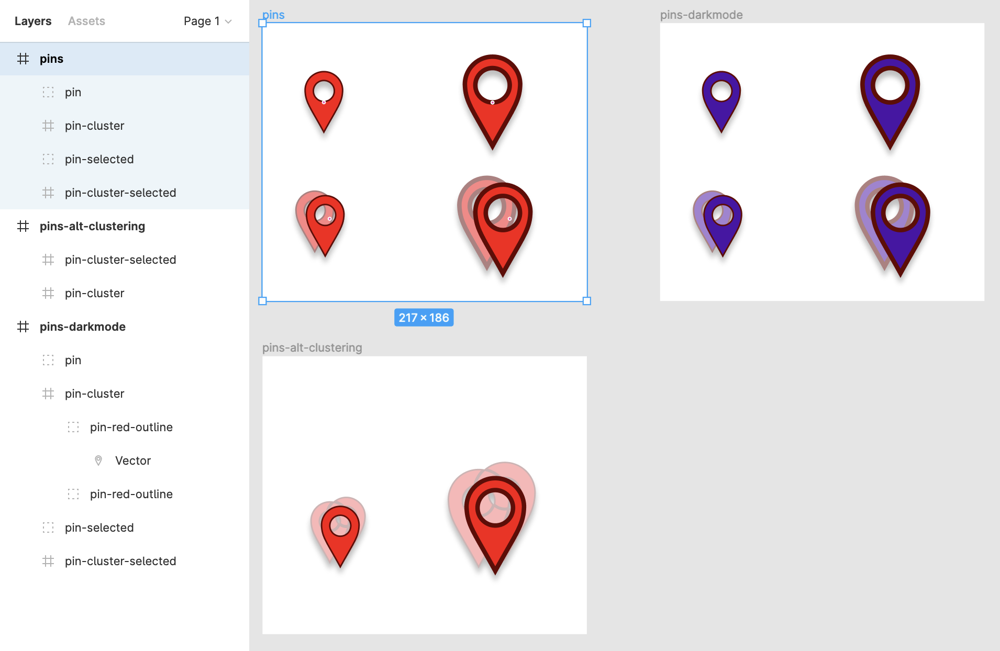

## Figmasset

Figmasset is a tool to facilitate bulk-loading assets from Figma into a JavaScript application. This makes it easy to load the latest version of assets under active development, including map marker icons, mockup UI overlays, legend images etc. Which means designers can iterate on assets, without needing developers to keep saving the latest copy of assets and redeploying.

Figmasset supports loading assets from several different frames in the same file. Assets loaded later will override earlier assets if they share a name.

This has two main uses:

1. Loading different groups of assets worked on by different people
2. Loading a "base" set of icons and an "override" set, so you can iterate on designs of a few icons without having to duplicate all the base icons.


Figmasset can be used in Node by importing the `node-fetch` library and passing it as the `fetchFunc` parameter.

**Note**: This library is still in early days and its interface is not stable.

### Setting up your assets in Figma

In Figma, arrange your assets as top-level children under one or more frames. That is, your Layers sidebar should look something like this:




```
# pins
  # pin
  # pin-cluster
  # pin-selected
  # pin-cluster-selected
# pins-alt-clustering
  # pin-cluster
  # pin-cluster-selected
```

(Some of the assets are frames, some are groups - this is fine.)

Naming:

* Top-level frame names should not contain spaces or commas.
* Top-level frame names are *not* case-sensitive.
* Asset names *are* case-sensitive. We recommend lower-case.

Get the file key from the URL. Given a URL like https://www.figma.com/file/ABC123/Untitled?node-id=0%3A1, "ABC123" is your file key.

### Loading assets into Mapbox GL JS or Maplibre GL JS

To retrieve your assets as icons and load them into a map, use `loadFigmassets()`, like this:

```js
import { loadFigmassets } from 'figmasset';

//...

loadFigmassets({
  map, // Mapbox GL JS or Maplibre GL JS object
  frameNames = ['pins', 'pins-alt-clustering'],
  fileKey: 'ABC123',
  personalAccessToken: 'snt34h5sn24h5', // get this from your user > Settings page. Be careful who you expose this to, it provides unrestricted access to your account
  scales: [2], // pixel ratios. [1,2] fetches both @1x and @2x versions of each asset.
});
map.addLayer({
  id: 'mypin',
  type: 'symbol',
  source: 'pointsource',
  layout: { 'icon-image': 'pin' }
});
```

`loadFigmassets()` is async, returning after icons have been generated by Figma, and are being loaded into your map. There is generally no need to `await` it, although you may get warnings in your console if you create map layers that reference icons that haven't been loaded yet.

### Loading your assets outside a map

You can use Figmasset outside of a map (for instance, to overlay static images). It returns an object of all the

```js
import { getFigmassets } from 'figmasset';

async function loadAssets() {
    return getFigmassets({
        frameNames = ['pins', 'pins-alt-clustering'],
        fileKey: 'ABC123',
        personalAccessToken: 'snt34h5sn24h5', // get this from your user > Settings page. Be careful who you expose this to, it provides unrestricted access to your account
        scales: [1, 2], // pixel ratios. [1,2] fetches both @1x and @2x versions of each asset.

        // other options:
        // frameIds = [], // you can specify frames by their node ID (in the URL) instead of frameNames
        // format: 'png', // svg is also supported
        // fetchFunc: nodeFetch // in the browser, window.fetch is used. If using in Node, pass in the node-fetch library.
    });
}
```

The Figma API can take a few seconds to generate PNG versions of assets. Once it returns, you will have an object of this form:

```js
{
  pin: {
    id: '2:8', // the node ID
    '@1x': 'https://s3-us-west-2.amazonaws.com/figma-alpha-api/img/5b83/a061/e42384a5bc5a5ac5cabcb5a5cabcb5c5,
    '@2x': 'https://s3-us-west-2.amazonaws.com/figma-alpha-api/img/af20/18b77f7fe7ee57f5efe5ef5ee7eaa2f32aea0'
  },
  'pin-cluster': { ... },
  'pin-selected': { ... },
  'pin-cluster-selected': { ... },
}
```

Note that the assets named `pin-cluster` and `pin-cluster-selected` in the `pins-alt-clustering` frame will be used, rather than those in `pins`. That's because the names match, and `pins-alt-clustering` was specified after `pins`.


### Moving to production

Once your asset designs have stabilised you will want to move to production without loading them from Figma dynamically. You can use [`figmasset-export`](https://www.npmjs.com/package/figmasset-export) for this. The process is:

1. Run figmasset-export to download assets and generate an asset metadata file, in a directory inside your web app. (Say its URL path is `static`, so you now have `static/assets@2x/assets.json` and so on).
2. Switch out the `loadFigmassets()` call above with `loadStoredFigmassets()` like this:


```js
loadStoredFigmassets({ map, path: 'static/assets@2x' });
```